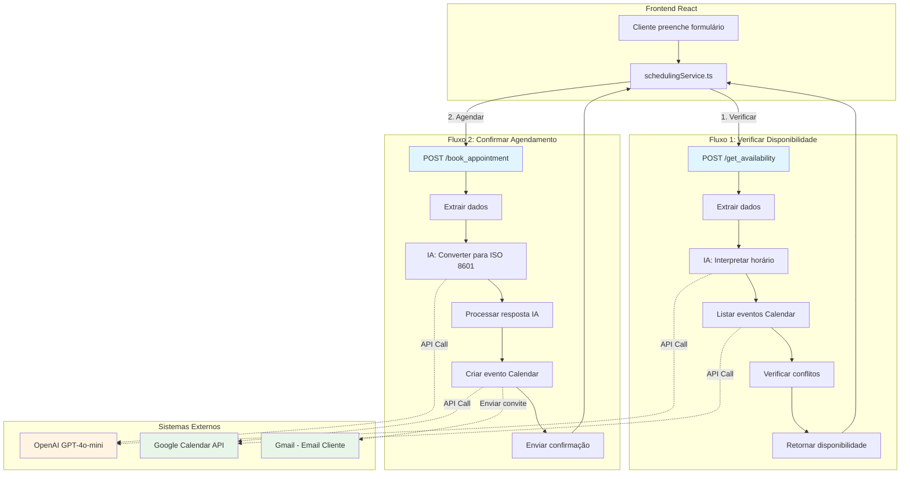
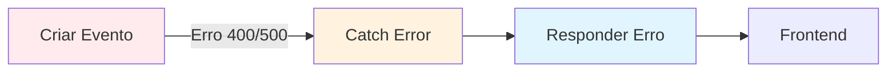

# 🔄 Arquitetura do Workflow de Agendamento

## 📊 Visão Geral

Este workflow implementa um sistema completo de agendamento com **interpretação de linguagem natural** usando IA e **integração direta com Google Calendar**.



---

## 🔍 Fluxo 1: Verificar Disponibilidade

### Entrada
```json
{
  "preferred_timeframe": "Terça-feira às 14h"
}
```

### Processamento

#### 1️⃣ **Webhook** (Endpoint de entrada)
- Recebe requisição POST
- Path: `/get_availability`
- Passa dados para próximo nó

#### 2️⃣ **Extrair Dados**
```javascript
{
  preferredTimeframe: "Terça-feira às 14h",
  currentDate: "2026-01-29T19:54:00.000Z"
}
```

#### 3️⃣ **IA - Interpretar Horário** (OpenAI)
**Prompt:**
> "Converta 'Terça-feira às 14h' para formato ISO 8601, sugira horários alternativos"

**Resposta da IA:**
```json
{
  "available": true,
  "requestedDateTime": "2026-02-04T14:00:00-03:00",
  "message": "O horário está disponível",
  "suggestedTimes": ["Segunda às 9h", "Quarta às 10h", "Quinta às 15h"]
}
```

#### 4️⃣ **Listar Eventos do Calendar**
- Busca eventos existentes no Google Calendar
- Retorna todos os eventos próximos

#### 5️⃣ **Verificar Conflitos**
```javascript
// Compara horário solicitado com eventos existentes
const hasConflict = calendarEvents.some(event => 
  event.start === requestedDateTime
);
```

#### 6️⃣ **Responder ao Frontend**
```json
{
  "available": true,
  "message": "✨ Ótima notícia! O horário está disponível.\n\nOutros horários:\n• Segunda às 9h\n• Quarta às 10h",
  "suggestedTimes": [...]
}
```

---

## 📅 Fluxo 2: Confirmar Agendamento

### Entrada
```json
{
  "customer_name": "Maria Silva",
  "customer_phone": "11987654321",
  "customer_email": "maria@example.com",
  "service_type": "Terapia Individual",
  "description": "Sessão personalizada",
  "preferred_timeframe": "Próxima terça às 14h"
}
```

### Processamento

#### 1️⃣ **Webhook** (Endpoint de entrada)
- Recebe requisição POST
- Path: `/book_appointment`
- Valida payload

#### 2️⃣ **Extrair Dados**
```javascript
{
  customerName: "Maria Silva",
  customerPhone: "11987654321",
  customerEmail: "maria@example.com",
  serviceType: "Terapia Individual",
  description: "Sessão personalizada",
  preferredTimeframe: "Próxima terça às 14h",
  currentDate: "2026-01-29T19:54:00.000Z"
}
```

#### 3️⃣ **IA - Converter para Data** (OpenAI)
**Prompt:**
> "Converta 'Próxima terça às 14h' para formato ISO 8601 com timezone -03:00. Data atual: 2026-01-29. Retorne JSON com startDateTime, endDateTime (1h depois), interpretedDate"

**Resposta da IA:**
```json
{
  "startDateTime": "2026-02-04T14:00:00-03:00",
  "endDateTime": "2026-02-04T15:00:00-03:00",
  "interpretedDate": "Terça-feira, 4 de fevereiro às 14h"
}
```

#### 4️⃣ **Processar Resposta da IA**
```javascript
// Parse do JSON e validação
// Monta dados completos para o Calendar

{
  startDateTime: "2026-02-04T14:00:00-03:00",
  endDateTime: "2026-02-04T15:00:00-03:00",
  eventSummary: "Terapia Individual - Maria Silva",
  eventDescription: "📋 Agendamento\n\n👤 Cliente: Maria Silva\n📧 Email: maria@example.com\n📱 Telefone: 11987654321\n\n🌟 Serviço: Terapia Individual"
}
```

#### 5️⃣ **Criar Evento no Google Calendar**
**Configuração:**
- **Calendar:** Primary
- **Summary:** "Terapia Individual - Maria Silva"
- **Start:** 2026-02-04T14:00:00-03:00
- **End:** 2026-02-04T15:00:00-03:00
- **Description:** Detalhes completos do agendamento
- **Attendees:** maria@example.com
- **Send Updates:** all (envia email de convite)
- **Timezone:** America/Sao_Paulo

**Resultado:**
```json
{
  "id": "abc123xyz",
  "htmlLink": "https://calendar.google.com/event?eid=...",
  "created": "2026-01-29T19:55:00.000Z",
  "status": "confirmed"
}
```

#### 6️⃣ **Responder Sucesso ao Frontend**
```json
{
  "success": true,
  "message": "Tudo certo! Você está agendado(a) para Terça-feira, 4 de fevereiro às 14h. 🎉",
  "booking": {
    "customer": "Maria Silva",
    "service": "Terapia Individual",
    "dateTime": "Terça-feira, 4 de fevereiro às 14h",
    "calendarEventId": "abc123xyz"
  }
}
```

---

## ⚠️ Fluxo de Erro

### Quando ocorre erro no Google Calendar



**Resposta de erro:**
```json
{
  "success": false,
  "message": "Não foi possível completar o agendamento. Por favor, tente novamente ou entre em contato via WhatsApp.",
  "error": "Calendar API: Bad Request - Invalid datetime format"
}
```

---

## 🔐 Segurança e Validações

### Validações Implementadas

#### No Frontend (`schedulingService.ts`)
```typescript
// Validação de telefone
validatePhone(phone: string): boolean
// Formato: 11999998888 (10-11 dígitos)

// Validação de email
validateEmail(email: string): boolean
// Regex: /^[^\s@]+@[^\s@]+\.[^\s@]+$/
```

#### No N8N (Nó "Processar Resposta da IA")
```javascript
// Valida se IA retornou datas
if (!parsedDate.startDateTime || !parsedDate.endDateTime) {
  throw new Error('IA não retornou datas válidas');
}

// Valida formato ISO 8601
const isoRegex = /^\d{4}-\d{2}-\d{2}T\d{2}:\d{2}:\d{2}[+-]\d{2}:\d{2}$/;
if (!isoRegex.test(parsedDate.startDateTime)) {
  throw new Error('Formato de data inválido');
}
```

---

## 📈 Performance e Custos

### Tempo Médio de Execução
- **Verificar Disponibilidade:** ~2-3 segundos
  - IA (OpenAI): ~1s
  - Google Calendar API: ~0.5s
  - Processamento: ~0.5s

- **Criar Agendamento:** ~3-4 segundos
  - IA (OpenAI): ~1.5s
  - Google Calendar API: ~1s
  - Envio de email: ~0.5s
  - Processamento: ~0.5s

### Custos Estimados (OpenAI)
- **Modelo:** gpt-4o-mini
- **Custo:** ~$0.000150 por request
- **100 agendamentos/mês:** ~$0.03 USD
- **1000 agendamentos/mês:** ~$0.30 USD

**Observação:** Extremamente econômico! 🎉

---

## 🎯 Vantagens da Solução

### ✅ Para o Cliente
- 🗣️ **Linguagem natural** - Pode digitar "amanhã de manhã" em vez de selecionar data/hora
- ⚡ **Resposta rápida** - Confirmação em segundos
- 📧 **Email automático** - Recebe convite do Google Calendar
- 📱 **Lembretes** - Google Calendar envia notificações

### ✅ Para o Negócio
- 🤖 **Automação total** - Zero intervenção manual
- 📊 **Organização** - Tudo centralizado no Google Calendar
- 💰 **Baixo custo** - Centavos por agendamento
- 🔄 **Escalável** - Suporta milhares de agendamentos
- 🛡️ **Confiável** - Google Calendar como backend

### ✅ Para Desenvolvimento
- 🔧 **Manutenível** - Código claro e documentado
- 🧪 **Testável** - Endpoints isolados
- 📝 **Auditável** - Logs de todas execuções
- 🔌 **Modular** - Fácil adicionar novos serviços

---

## 🚀 Melhorias Futuras (Opcional)

### 1. Integração com WhatsApp
- Adicionar nó para enviar confirmação via WhatsApp
- Usar Twilio ou WhatsApp Business API

### 2. Lembretes Automáticos
- 24h antes: Enviar lembrete por email
- 1h antes: Enviar SMS

### 3. Cancelamento/Reagendamento
- Criar endpoint `/cancel_appointment`
- Criar endpoint `/reschedule_appointment`

### 4. Dashboard de Métricas
- Agendamentos por serviço
- Taxa de conversão
- Horários mais procurados

### 5. Sistema de Fila de Espera
- Se horário indisponível, adicionar à fila
- Notificar quando surgir vaga

---

**Versão:** production-v1  
**Última atualização:** 29/01/2026  
**Compatibilidade:** n8n v0.219.0+
