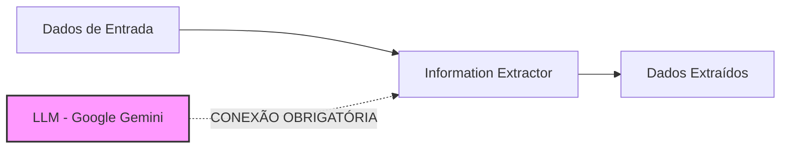

# 🔧 Fix Rápido: Erro "Text for item 0 is not defined"

## ❌ Erro Atual

```
Error no agente 'IA - Verificar Disponibilidade':
Text for item 0 is not defined
```

**HTTP Status:** 500  
**Endpoint:** `https://n8n.digitalfisher.com.br/webhook/get_availability`

---

## 🔍 Causa Raiz

O nó **"Information Extractor"** (tipo `@n8n/n8n-nodes-langchain.informationExtractor`) **não está conectado ao modelo de linguagem (LLM)**.

### Como o Information Extractor Funciona:



**Sem a conexão do LLM:** O nó não consegue processar o texto e retorna erro "Text for item 0 is not defined".

---

## ✅ Solução

### Passo 1: Abrir o Workflow no N8N

1. Acesse o n8n
2. Abra o workflow "Instituto Ariana Borges - Agendamento"

### Passo 2: Conectar o Google Gemini Chat Model

#### A) No nó "IA - Converter Texto para Data":

1. Clique no nó **"IA - Converter Texto para Data"**
2. **Scroll down** até a seção **"Options"** ou **"Model"**
3. Procure por **"Chat Model"** ou **"Language Model"**
4. Clique no campo e selecione: **"Google Gemini Chat Model"**
5. ✅ Salve

#### B) No nó "IA - Verificar Disponibilidade":  

1. Clique no nó **"IA - Verificar Disponibilidade"**
2. **Scroll down** até a seção **"Options"** ou **"Model"**
3. Procure por **"Chat Model"** ou **"Language Model"**
4. Clique no campo e selecione: **"Google Gemini Chat Model"**
5. ✅ Salve

### Passo 3: Verificar Conexões Visuais

No canvas do n8n, você deve ver linhas tracejadas conectando:

```
Google Gemini Chat Model
    ↓ (linha tracejada)
IA - Converter Texto para Data

Google Gemini Chat Model
    ↓ (linha tracejada)
IA - Verificar Disponibilidade
```

---

## 📸 Como Fazer (Visual)

### Interface do Information Extractor:

Quando você clica no nó, o painel lateral deve mostrar:

```
┌─────────────────────────────────────┐
│ Information Extractor               │
├─────────────────────────────────────┤
│ Text ▼                              │
│ {{ $json.preferredTimeframe }}      │
├─────────────────────────────────────┤
│ Schema Type ▼                       │
│ From JSON                           │
├─────────────────────────────────────┤
│ JSON Schema Example                 │
│ { ... }                             │
├─────────────────────────────────────┤
│ ⚙️ Options                          │
│   ├─ System Prompt Template         │
│   └─ 🤖 Chat Model ◄── AQUI!       │
│       └─ [Selecione um modelo]      │
└─────────────────────────────────────┘
```

**Clique em "Chat Model" e selecione "Google Gemini Chat Model"**

---

## 🔄 Alternativa: Editar o JSON Diretamente

Se preferir editar o JSON do workflow:

### Localizar os nós:

```json
{
  "id": "ai-parse-date-booking",
  "name": "IA - Converter Texto para Data"
}
```

E:

```json
{
  "id": "ai-check-availability",
  "name": "IA - Verificar Disponibilidade"
}
```

### Verificar conexões:

Na seção `"connections"`, deve ter:

```json
"Google Gemini Chat Model": {
  "ai_languageModel": [
    [
      {
        "node": "IA - Converter Texto para Data",
        "type": "ai_languageModel",
        "index": 0
      },
      {
        "node": "IA - Verificar Disponibilidade",
        "type": "ai_languageModel",
        "index": 0
      }
    ]
  ]
}
```

✅ **Essa conexão já existe** no arquivo atualizado!

---

## 🧪 Testar Após Correção

```bash
curl -X POST https://n8n.digitalfisher.com.br/webhook/get_availability \
  -H "Content-Type: application/json" \
  -d '{"preferred_timeframe": "Terça às 14h"}'
```

**Resposta esperada (sucesso):**

```json
{
  "available": true,
  "message": "✨ Ótima notícia! O horário solicitado está disponível.\n\nOutros horários disponíveis:\n• Segunda-feira às 9h\n• Quarta-feira às 10h",
  "suggestedTimes": ["Segunda-feira às 9h", "Quarta-feira às 10h", "Quinta-feira às 15h"]
}
```

---

## 🚨 Se o Erro Persistir

### Checklist de Debug:

- [ ] Credenciais do Google Gemini configuradas?
- [ ] Google Gemini Chat Model tem conexão visual (linha tracejada) com os nós de IA?
- [ ] Workflow está **ativo** (toggle green)?
- [ ] API Key do Google Gemini válida?
- [ ] Teste manual do nó "Google Gemini Chat Model" funciona?

### Log de Debug:

Execute o workflow manualmente e verifique:
1. **Executions** (menu lateral)
2. Clique na execução com erro
3. Clique no nó "IA - Verificar Disponibilidade"
4. Verifique a aba **"Input"** → deve mostrar `preferredTimeframe`
5. Verifique a aba **"Output"** → deve mostrar o erro exato

---

## 📝 Nota Importante

O arquivo `n8n-workflow-agendamento.json` **JÁ ESTÁ ATUALIZADO** com as conexões corretas.

Se você importou o workflow atualizado e ainda vê o erro, significa que **as conexões visuais não foram preservadas** na importação.

**Solução:** Reconectar manualmente os nós conforme instruções acima.

---

**Última atualização:** 29/01/2026  
**Versão do fix:** 1.0
