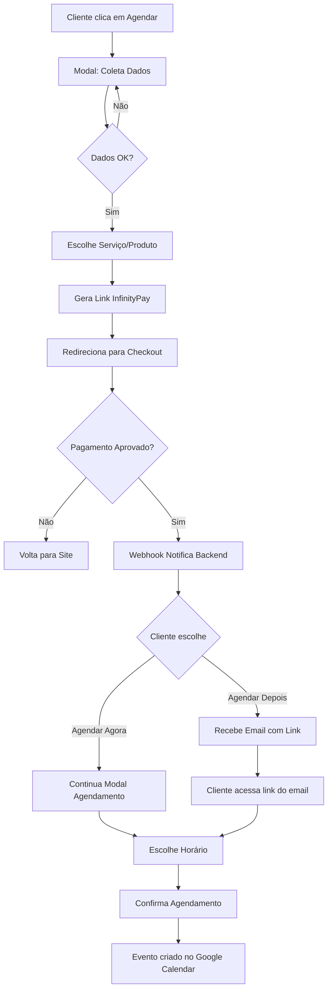

# Plano de Implementação: Integração InfinityPay + Agendamento

## 📋 Objetivo

Integrar pagamentos via InfinityPay ao fluxo de agendamento existente, permitindo que clientes paguem antes de agendar suas sessões.

---

## 🎯 Fluxo Proposto



---

## 🔍 Análise da Situação Atual

### Fluxo Atual de Agendamento

**Passos:**
1. Cliente clica em "Marque um Atendimento"
2. Modal abre com 5 passos:
   - Passo 1: Nome
   - Passo 2: Telefone
   - Passo 3: Email
   - Passo 4: Escolha do serviço
   - Passo 5: Horário preferido
3. Sistema verifica disponibilidade (n8n webhook `/get_availability`)
4. Cliente confirma agendamento
5. Sistema cria evento (n8n webhook `/book_appointment`)
6. Google Calendar é atualizado

**Arquivos Envolvidos:**
- [`SchedulingChat.tsx`](file:///media/henrique/443CC9553CC942A22/apps-projects/site-instituto-ariana-borges/src/components/SchedulingChat.tsx) - Modal de agendamento
- [`schedulingService.ts`](file:///media/henrique/443CC9553CC942A22/apps-projects/site-instituto-ariana-borges/src/services/schedulingService.ts) - Chamadas API
- [`n8n-workflow-agendamento.json`](file:///media/henrique/443CC9553CC942A22/apps-projects/site-instituto-ariana-borges/n8n-workflow-agendamento.json) - Workflow N8N

---

## 🚀 Mudanças Necessárias

### 1. Frontend (React + TypeScript)

#### 1.1. Novo Serviço: `infinityPayService.ts`

**Localização:** `src/services/infinityPayService.ts`

**Funcionalidades:**
```typescript
// Criar link de checkout
export const createCheckoutLink = async (
  handle: string,
  items: PaymentItem[],
  customer: Customer,
  orderNsu?: string,
  redirectUrl?: string,
  webhookUrl?: string
): Promise<CheckoutLinkResponse>

// Verificar status do pagamento
export const checkPaymentStatus = async (
  handle: string,
  orderNsu: string,
  transactionNsu: string,
  slug: string
): Promise<PaymentStatusResponse>
```

**Endpoint:**
- POST `https://api.infinitepay.io/invoices/public/checkout/links`
- POST `https://api.infinitepay.io/invoices/public/checkout/payment_check`

---

#### 1.2. Atualizar `SchedulingChat.tsx`

**Novo Fluxo:**

**Passos Atualizados:**
1. `name` - Coleta nome ✅ (mantém)
2. `phone` - Coleta telefone ✅ (mantém)
3. `email` - Coleta email ✅ (mantém)
4. `service` - Escolha do serviço ✅ (mantém)
5. **`payment`** - 🆕 **NOVO**: Gera link InfinityPay e redireciona
6. `payment_return` - **NOVO**: Página de retorno após pagamento
7. `schedule_choice` - **NOVO**: Escolher quando agendar (agora ou depois)
8. `timeframe` - Horário preferido (mantém)
9. `confirming` - Confirmação (mantém)
10. `success` - Sucesso (mantém)

**Mudanças Específicas:**

```typescript
// Adicionar novo estado
const [paymentData, setPaymentData] = useState<{
  orderNsu: string;
  transactionNsu: string;
  slug: string;
  paid: boolean;
} | null>(null);

// Nova função para gerar checkout (via N8N Proxy para evitar CORS)
const handleServiceSelection = async (service: string) => {
  setServiceType(service);
  setStep('payment');
  
  // Chama Webhook N8N (Backend Proxy)
  const response = await fetch(`${N8N_WEBHOOK_URL}/create_payment_link`, {
      method: 'POST',
      body: JSON.stringify({
        handle: 'institutoarianaborges',
        items: [getServiceItem(service)], // N8N vai formatar isso corretamente
        customer: {
          name: clientData.name,
          email: clientData.email,
          phone_number: clientData.phone
        },
        redirectUrl: `${window.location.origin}/payment-return`,
        webhookUrl: `${N8N_WEBHOOK_URL}/infinitypay_webhook`
      })
  });
  
  const data = await response.json();
  
  // Redireciona para checkout
  window.open(data.url, '_blank');
};
```

> [!WARNING]
> **Atenção CORS:** A API da InfinityPay não permite chamadas diretas do navegador (`Access-Control-Allow-Origin` ausente). Por isso, **é obrigatório** usar o N8N como proxy.
> **Correção de Documentação:** O campo correto para itens é `items` (inglês), e não `itens` como consta em alguns exemplos.

---

#### 1.3. Nova Página: `PaymentReturn.tsx`

**Localização:** `src/pages/PaymentReturn.tsx`

**Funcionalidade:**
- Recebe parâmetros da URL: `receipt_url`, `order_nsu`, `slug`, `transaction_nsu`
- Verifica status do pagamento
- Oferece opções:
  - **Agendar Agora**: Reabre modal no passo de escolha de horário
  - **Agendar Depois**: Mostra mensagem de confirmação

```typescript
const PaymentReturn = () => {
  const [searchParams] = useSearchParams();
  const orderNsu = searchParams.get('order_nsu');
  const transactionNsu = searchParams.get('transaction_nsu');
  const slug = searchParams.get('slug');
  const receiptUrl = searchParams.get('receipt_url');
  
  // Verificar pagamento
  useEffect(() => {
    checkPaymentStatus(/* ... */).then(/* ... */);
  }, []);
  
  return (/* UI */)
};
```

---

### 2. Backend (N8N Workflows)

#### 2.1. Novo Webhook: `/infinitypay_webhook`

**Objetivo:** Receber notificações de pagamento aprovado

**Fluxo:**
```
Webhook InfinityPay
  → Validar Payload
  → Extrair Dados (order_nsu, transaction_nsu, customer)
  → Criar Registro no Banco de Dados*
  → Enviar Email com Link de Agendamento
Webhook InfinityPay
  → Validar Payload
  → Extrair Dados (order_nsu, transaction_nsu, customer)
  → Criar Registro no Banco de Dados (Data Tables ou Supabase)
  → Enviar Email com Link de Agendamento
  → Responder 200 OK
```

#### 2.2. Novo Webhook: `/create_payment_link` (Proxy)

**Objetivo:** Gerar link de pagamento (Interface Frontend -> InfinityPay API)

**Fluxo:**
```
Webhook /create_payment_link
  → Recebe dados do Frontend
  → Formata Payload (Corrige 'items')
  → HTTP Request: POST https://api.infinitepay.io/invoices/public/checkout/links
  → Retorna JSON { "url": "..." } para o Frontend
```

**Dados Recebidos:**
```json
{
  "invoice_slug": "abc123",
  "amount": 10000,
  "paid_amount": 10010,
  "installments": 1,
  "capture_method": "credit_card",
  "transaction_nsu": "UUID",
  "order_nsu": "order-123",
  "receipt_url": "https://...",
  "items": [...]
}
```

**Email Template:**
```
Assunto: ✅ Pagamento Confirmado - Agende sua Sessão

Olá [NOME],

Seu pagamento foi confirmado! 🎉

📋 Detalhes da Compra:
- Serviço: [SERVICO]
- Valor: R$ [VALOR]
- Comprovante: [LINK_COMPROVANTE]

⏰ Próximo Passo: Agende sua Sessão
Clique no botão abaixo para escolher o melhor horário:

[BOTÃO: Agendar Minha Sessão]
Link: https://institutoarianaborges.com.br/schedule?token=[TOKEN]

Obs: Este link é válido por 30 dias.

Até breve! 🌟
Instituto Ariana Borges
```

---

#### 2.2. Novo Webhook: `/schedule_with_token`

**Objetivo:** Permitir agendamento via link do email

**Fluxo:**
```
Webhook /schedule_with_token
  → Validar Token
  → Buscar Dados do Cliente e Serviço
  → Verificar Disponibilidade
  → Criar Evento no Google Calendar
  → Enviar Email de Confirmação
```

**Parâmetros:**
```json
{
  "token": "UUID-token-seguro",
  "preferred_timeframe": "Quarta às 14h"
}
```

---

#### 2.3. Atualizar Workflow Existente

**Mudanças em `/book_appointment`:**

- Adicionar verificação: "Pagamento já aprovado?"
- Se **SIM**: Prosseguir normalmente
- Se **NÃO**: Retornar erro "Pagamento pendente"

---

### 3. Banco de Dados / Armazenamento

> [!IMPORTANT]
> Você precisará decidir onde armazenar os dados de pagamento temporários.

**Opções:**

**Opção A: Supabase (Recomendado)**
- Criar tabela `payments`:
  ```sql
  CREATE TABLE payments (
    id UUID PRIMARY KEY DEFAULT uuid_generate_v4(),
    order_nsu TEXT UNIQUE NOT NULL,
    transaction_nsu TEXT,
    slug TEXT,
    customer_name TEXT,
    customer_email TEXT,
    customer_phone TEXT,
    service_type TEXT,
    amount INTEGER,
    paid_amount INTEGER,
    capture_method TEXT,
    receipt_url TEXT,
    paid_at TIMESTAMP,
    scheduled BOOLEAN DEFAULT FALSE,
    schedule_token TEXT UNIQUE,
    created_at TIMESTAMP DEFAULT NOW()
  );
  ```

**Opção B: N8N Database Node**
- Usar nó "Postgres" ou "MySQL" no n8n

**Opção C: Google Sheets (Simples, mas menos seguro)**
- Criar planilha "Pagamentos"
- Colunas: Order NSU, Cliente, Serviço, Status, Token, etc.

---

### 4. Mapeamento Serviços → Produtos InfinityPay

**Atualizar `SERVICE_TYPES`:**

```typescript
export const SERVICE_TYPES = [
  {
    id: 'terapia-individual',
    name: 'Terapia Individual',
    description: 'Sessão de terapia personalizada',
    price: 15000, // R$ 150,00 em centavos
    duration: '1h'
  },
  {
    id: 'taro-salomao',
    name: 'Tarô de Salomão',
    description: 'Leitura oracular (45 min)',
    price: 8000, // R$ 80,00
    duration: '45min'
  },
  // ... outros serviços
];
```

**Função Helper:**
```typescript
const getServiceItem = (serviceId: string): PaymentItem => {
  const service = SERVICE_TYPES.find(s => s.id === serviceId);
  return {
    quantity: 1,
    price: service.price,
    description: `${service.name} - ${service.description}`
  };
};
```

---

## 📝 Checklist de Implementação

### Fase 1: Preparação (1-2 dias)

- [ ] Criar conta InfinityPay (se ainda não tem)
- [ ] Obter InfiniteTag (@institutoarianaborges)
- [ ] Definir preços de cada serviço
- [ ] Escolher opção de banco de dados (Supabase recomendado)
- [ ] Criar estrutura de banco (tabela `payments`)

---

### Fase 2: Backend - N8N Workflows (2-3 dias)

- [ ] Criar webhook `/infinitypay_webhook`
  - [ ] Validar payload InfinityPay
  - [ ] Salvar dados no banco
  - [ ] Gerar token de agendamento (UUID)
  - [ ] Enviar email com link
  - [ ] Responder 200 OK

- [ ] Criar webhook `/schedule_with_token`
  - [ ] Validar token
  - [ ] Buscar dados do pagamento
  - [ ] Verificar disponibilidade
  - [ ] Criar evento no Google Calendar
  - [ ] Marcar como "agendado" no banco
  - [ ] Enviar email de confirmação

- [ ] Atualizar webhook `/book_appointment`
  - [ ] Adicionar validação de pagamento

- [ ] Criar template de email HTML

---

### Fase 3: Frontend - Serviço InfinityPay (1 dia)

- [ ] Criar `src/services/infinityPayService.ts`
  - [ ] Interface `PaymentItem`
  - [ ] Interface `Customer`
  - [ ] Interface `CheckoutLinkResponse`
  - [ ] Função `createCheckoutLink()`
  - [ ] Função `checkPaymentStatus()`
  - [ ] Tratamento de erros

- [ ] Criar variável de ambiente
  - [ ] `VITE_INFINITYPAY_HANDLE=institutoarianaborges`

---

### Fase 4: Frontend - Componentes (2-3 dias)

- [ ] Atualizar `SchedulingChat.tsx`
  - [ ] Adicionar step `payment`
  - [ ] Adicionar estado `paymentData`
  - [ ] Implementar `handleServiceSelection()`
  - [ ] Atualizar UI para mostrar preços
  - [ ] Adicionar loading durante geração do link

- [ ] Criar `PaymentReturn.tsx`
  - [ ] Extrair parâmetros da URL
  - [ ] Verificar status do pagamento
  - [ ] UI: Botão "Agendar Agora"
  - [ ] UI: Opção "Agendar Depois"
  - [ ] Link para comprovante

- [ ] Criar `ScheduleWithToken.tsx` (página pública)
  - [ ] Aceitar `?token=UUID` na URL
  - [ ] Mostrar dados do serviço comprado
  - [ ] Formulário de escolha de horário
  - [ ] Chamar `/schedule_with_token`

- [ ] Atualizar rotas no `App.tsx`
  ```typescript
  <Route path="/payment-return" element={<PaymentReturn />} />
  <Route path="/schedule" element={<ScheduleWithToken />} />
  ```

---

### Fase 5: Atualizar SERVICE_TYPES (1 dia)

- [ ] Adicionar campo `price` em cada serviço
- [ ] Adicionar campo `duration`
- [ ] Criar função `getServiceItem()`
- [ ] Atualizar UI para mostrar preços no modal

---

### Fase 6: Testes (2-3 dias)

#### Testes de Integração

- [ ] **Teste 1: Pagamento via Cartão**
  - [ ] Cliente escolhe serviço
  - [ ] Link InfinityPay é gerado
  - [ ] Pagamento com cartão funciona
  - [ ] Webhook recebe notificação
  - [ ] Email é enviado com link
  - [ ] Link permite agendamento

- [ ] **Teste 2: Pagamento via PIX**
  - [ ] Mesmo fluxo, método PIX
  - [ ] Verificar tempo de confirmação

- [ ] **Teste 3: Agendamento Imediato**
  - [ ] Após pagamento, clicar "Agendar Agora"
  - [ ] Modal reabre no passo correto
  - [ ] Dados do cliente são mantidos
  - [ ] Agendamento é criado

- [ ] **Teste 4: Agendamento Posterior**
  - [ ] Após pagamento, escolher "Agendar Depois"
  - [ ] Email é recebido
  - [ ] Link do email funciona
  - [ ] Token é validado
  - [ ] Agendamento é criado

- [ ] **Teste 5: Token Expirado**
  - [ ] Tentar usar token após 30 dias
  - [ ] Sistema mostra erro apropriado

- [ ] **Teste 6: Token Já Usado**
  - [ ] Tentar agendar 2x com mesmo token
  - [ ] Segunda tentativa é bloqueada

---

### Fase 7: Documentação (1 dia)

- [ ] Documentar novos endpoints
- [ ] Atualizar README com instruções
- [ ] Criar guia de troubleshooting
- [ ] Documentar variáveis de ambiente

---

### Fase 8: Deploy (1 dia)

- [ ] Configurar variáveis de ambiente em produção
- [ ] Importar workflows N8N em produção
- [ ] Testar em produção com valores reais pequenos
- [ ] Monitorar primeiros pagamentos

---

## 🔐 Segurança

### Validações Importantes

1. **Webhook InfinityPay:**
   - Validar que a requisição vem do IP da InfinityPay
   - Verificar assinatura/token se disponível

2. **Token de Agendamento:**
   - Usar UUID v4 (impossível adivinhar)
   - Expiração de 30 dias
   - Invalidar após uso (scheduled = true)

3. **Dados Sensíveis:**
   - Não logar dados de cartão (InfinityPay já cuida disso)
   - Criptografar tokens no banco

---

## 💰 Estimativa de Custos

**InfinityPay:**
- Taxas por transação (verificar com InfinityPay)
- Sem mensalidade

**Google Calendar:**
- Grátis (até 100 eventos/dia)

**N8N:**
- Já está hospedado

**Supabase (se escolher):**
- Free tier: 500MB database
- Suficiente para começar

---

## 📊 Métricas para Acompanhar

- Taxa de conversão (serviços visualizados → pagamentos)
- Taxa de agendamento após pagamento
  - Imediato vs Posterior
- Tempo médio para agendar após pagamento
- Taxa de abandono no checkout InfinityPay
- Métodos de pagamento mais usados (PIX vs Cartão)

---

## 🎨 Melhorias Futuras (Opcional)

1. **Dashboard de Vendas:**
   - Visualizar pagamentos em tempo real
   - Gráficos de conversão

2. **Sistema de Cupons:**
   - Integrar descontos ao InfinityPay

3. **Pacotes de Sessões:**
   - Comprar 5 sessões com desconto
   - Agendar múltiplas sessões de uma vez

4. **Cancelamento/Reagendamento:**
   - Permitir reagendar com link do email
   - Política de cancelamento

5. **Lembretes Automáticos:**
   - WhatsApp API para lembrar cliente
   - Email 24h antes da sessão

---

## ❓ Perguntas para o Usuário

> [!WARNING]
> Antes de começar, precisamos definir:

1. **Preços dos Serviços:**
   - Quanto custa cada serviço?
   - Aceita parcelamento? (InfinityPay suporta)

2. **Banco de Dados:**
   - Você já tem Supabase configurado?
   - Prefere outra opção?

3. **Email:**
   - Já tem serviço de email configurado no N8N?
   - Qual? (Gmail, SendGrid, etc.)

4. **Validade do Link:**
   - 30 dias está bom ou prefere outro prazo?

5. **Política de Cancelamento:**
   - Cliente pode remarcar depois de pagar?
   - Reembolso é manual ou automático?

---

## 📚 Recursos e Referências

- [Documentação InfinityPay](file:///media/henrique/443CC9553CC942A22/apps-projects/site-instituto-ariana-borges/repositorio/api-infinity-pay)
- [N8N Workflow Atual](file:///media/henrique/443CC9553CC942A22/apps-projects/site-instituto-ariana-borges/n8n-workflow-agendamento.json)
- [SchedulingChat Component](file:///media/henrique/443CC9553CC942A22/apps-projects/site-instituto-ariana-borges/src/components/SchedulingChat.tsx)

---

**Criado em:** 29/01/2026  
**Versão:** 1.0  
**Status:** 🟡 Aguardando Aprovação
